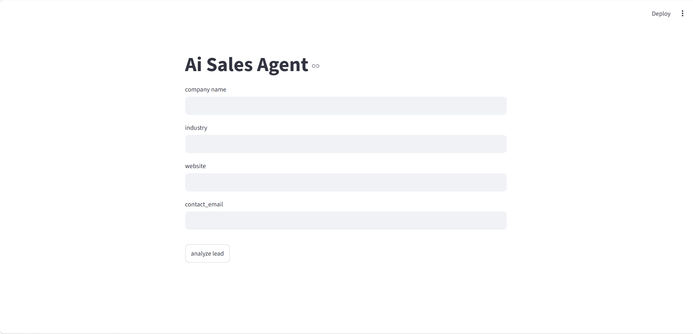
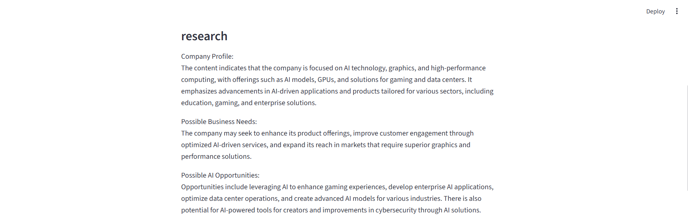
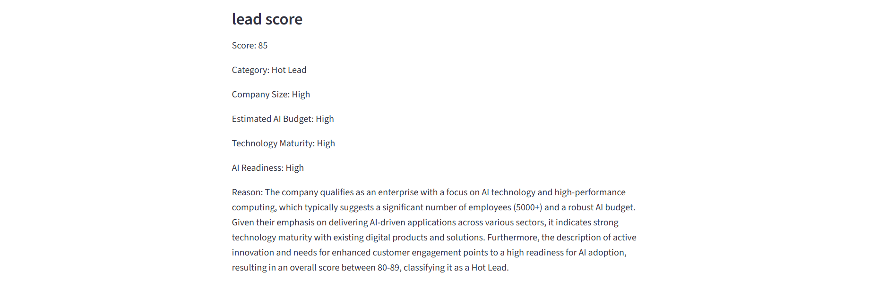
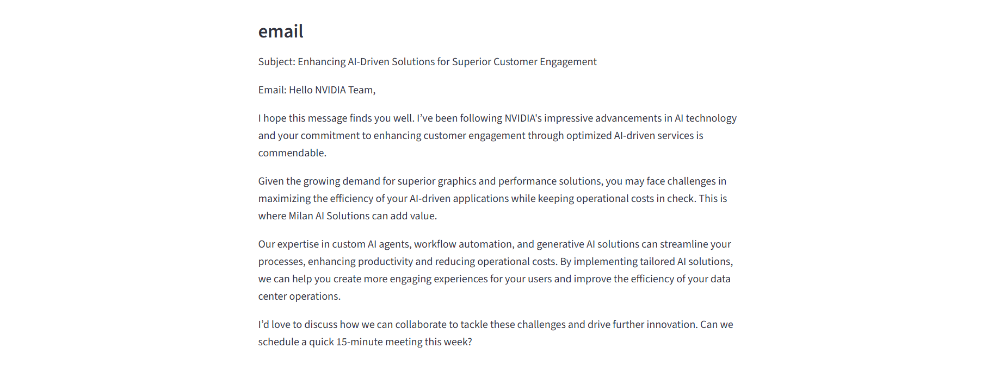
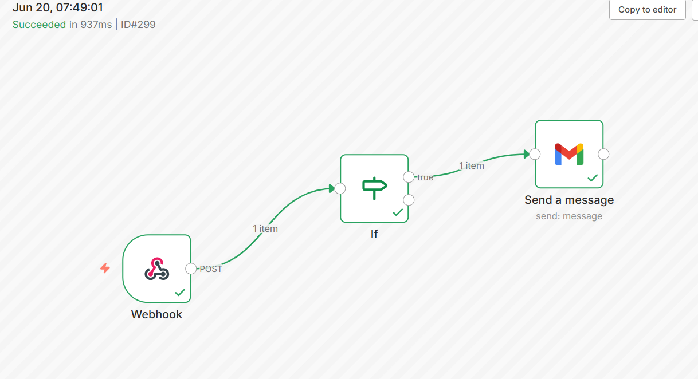

# 🤖 AI Sales Agent

An AI-powered sales automation platform that researches companies, qualifies leads, generates personalized outreach emails, stores lead information, and automates email delivery using AI Agents, FastAPI, PostgreSQL, Streamlit, and n8n.

# 🚀 Features

- 🔍 Company Website Research
- 🤖 AI-powered Company Analysis
- 📊 Intelligent Lead Scoring
- ✉️ Personalized Sales Email Generation
- 🗄️ PostgreSQL Database Integration
- ⚡ FastAPI REST API
- 🎨 Streamlit Frontend
- 🔄 n8n Workflow Automation
- 📧 Automatic Gmail Integration
              

# 🧠 AI Agent Workflow

### 1. Company Research Agent

- Scrapes company website
- Understands company profile
- Identifies business needs
- Finds AI opportunities

### 2. Lead Scoring Agent

Evaluates:

- Company Size
- Estimated AI Budget
- Technology Maturity
- AI Readiness
- Business Need

Lead Categories

| Score | Category |
|--------|----------|
| 80-100 | 🔥 Hot Lead |
| 50-79 | 🟡 Warm Lead |
| 0-49 | ❄️ Cold Lead |

### 3. Email Generation Agent

Generates:

- Personalized subject line
- Company-specific outreach email
- AI solution recommendations
- Meeting CTA


# Screenshots

## Home Page



## Research Details



---

## Lead Analysis




## AI Generated Email



---

## n8n Workflow

 

# 🛠️ Tech Stack

## Frontend

- Streamlit

## Backend

- FastAPI

## AI Framework

- LangGraph

## LLM

- OpenAI GPT

## Database

- PostgreSQL
- SQLAlchemy

## Automation

- n8n

## Email

- Gmail

## Language

- Python

# 📂 Project Structure

AI-Sales-Agent/

│── app.py
│── fast_api.py
│── agent.py
│── database.py
│── database_model.py
│── create_save_lead.py
│── README.md


## Configure Environment Variables

Create a `.env` file.

```
OPENAI_API_KEY=your_api_key

DATABASE_URL=your_database_url
```

---

## Run FastAPI

```bash
uvicorn fast_api:app --reload
```

---

## Run Streamlit

```bash
streamlit run app.py
```

---

## Run n8n

```bash
n8n start

# 🔄 Workflow

1. User enters:

- Company Name
- Industry
- Website
- Contact Email

↓

2. FastAPI receives request

↓

3. AI Research Agent analyzes company

↓

4. Lead Scoring Agent scores lead

↓

5. Email Generation Agent creates personalized email

↓

6. Lead saved in PostgreSQL

↓

7. n8n receives webhook

↓

8. Gmail automatically sends outreach email

# 📌 Example Output

### Research

- Company Profile
- Business Needs
- AI Opportunities

### Lead Score

Score: 90

Category: Hot Lead


### Email

```
Subject: Unlocking AI Opportunities

Hello {company name},

...

# Future Improvements

- Docker Support
- AWS Deployment
- CRM Integration
- LinkedIn Lead Scraping
- Dashboard Analytics

---

# 👨‍💻 Author

**Milan Kamboj**

